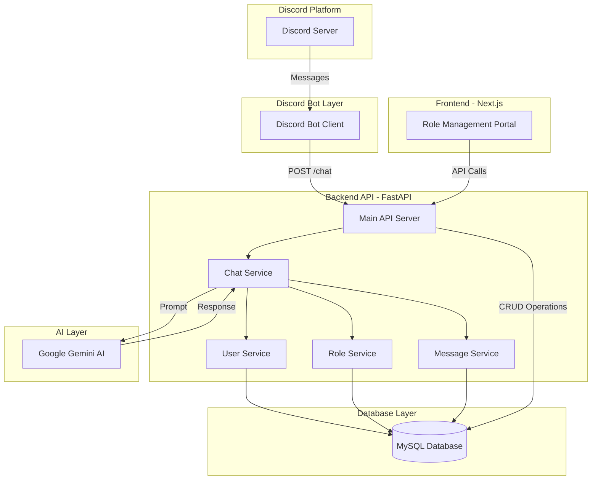
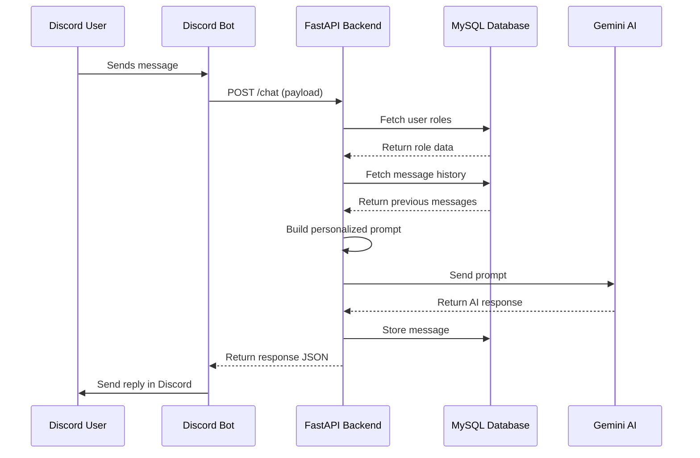
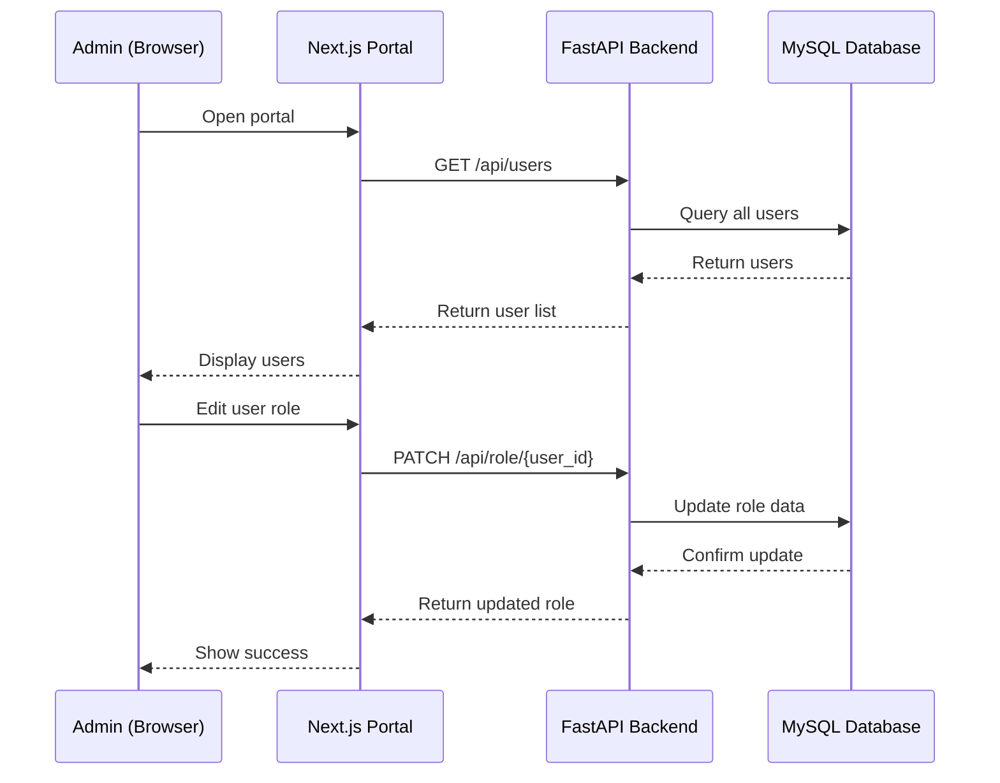

# 🤖 Discord AI Personality Bot

An intelligent Discord bot that mimics your personality and communication style using AI. The bot learns from role-based configurations and message history to respond to Discord messages as if you were typing them yourself.

## 📋 Project Description

This project is a full-stack application that combines a Discord bot with a FastAPI backend and Next.js frontend. The bot uses Google's Gemini AI to generate personalized responses based on:

- **User-specific roles and relationships** (bestfriend, friend, colleague, etc.)
- **Personality traits and preferences** (nicknames, nature, interests)
- **Conversation history** (previous messages for context)
- **Your personal profile** (age, interests, communication style)

The system includes a web-based **Role Management Portal** where you can configure how the bot should interact with different people in your Discord server.

---

## 🎯 What the Model Does

The AI model (Google Gemini 2.5 Flash) acts as your digital twin by:

1. **Analyzing incoming Discord messages** from different users
2. **Retrieving role-specific information** about each user from the database
3. **Fetching conversation history** to maintain context
4. **Generating personalized responses** that match your communication style
5. **Adapting language and tone** based on the relationship (formal, casual, romantic, etc.)

### Example Use Case

If someone named "John" (configured as your friend) sends you a message, the bot will:
- Use nicknames like "buddy", "pal"
- Reference shared interests (Roblox, math)
- Maintain a warm, affectionate tone
- Remember previous conversations

---

## 🏗️ System Architecture



### Component Breakdown

| Component | Technology | Purpose |
|-----------|-----------|---------|
| **Discord Bot** | discord.py | Listens to messages and sends responses |
| **Backend API** | FastAPI + SQLAlchemy | Handles business logic and data management |
| **AI Engine** | Google Gemini 2.5 Flash | Generates personalized responses |
| **Database** | MySQL | Stores users, roles, and message history |
| **Frontend Portal** | Next.js 15 + React | Web interface for role management |

---

## 💻 Tech Stack

### Backend
- **Framework**: FastAPI (Python 3.11+)
- **ORM**: SQLAlchemy (Async)
- **Database Driver**: aiomysql
- **AI SDK**: Google Generative AI (Gemini)
- **Discord Library**: discord.py
- **Environment Management**: python-dotenv

### Frontend
- **Framework**: Next.js 15
- **Language**: TypeScript/JavaScript
- **Styling**: CSS Modules
- **HTTP Client**: Fetch API

### Database
- **DBMS**: MySQL 8.0+
- **Tables**: `users`, `role`, `bot_messages`, `channel_messages`

### DevOps
- **Server**: Uvicorn (ASGI)
- **Package Manager**: pip (Python), npm (Node.js)

---

## 🔄 Data Flow

### 1. Message Processing Flow



### 2. Role Management Flow



### 3. Database Schema

```
users
├── id (PK)
├── user_id (Unique)
├── username
├── created_at
└── updated_at

role
├── id (PK)
├── user_id (Unique, FK)
├── user_name
└── role (JSON)

bot_messages
├── id (PK)
├── channel_id
├── user_id
├── content
└── dateTime

channel_messages
├── id (PK)
├── server_id
├── channel_id
├── user_id
├── content
└── dateTime
```

---

## 📚 Comprehensive User Guide

### Prerequisites

Before you begin, ensure you have:

- ✅ **Python 3.11+** installed
- ✅ **Node.js 18+** and npm installed
- ✅ **MySQL 8.0+** running
- ✅ **Discord Bot Token** ([Create ](https://discord.com/developers/applications))
- ✅ **Google Gemini API Key** ([Get it here](https://aistudio.google.com/app/apikey))

---

### 🚀 Installation & Setup

#### Step 1: Clone the Repository

```bash
git clone https://github.com/p2ratik/Discord-Bot
```

#### Step 2: Configure Environment Variables

Create a `.env` file in the root directory:

```env
# Database Configuration
MYSQL_KEY=your_mysql_password

# Discord Bot Token
SECRET_KEY=your_discord_bot_token

# Google Gemini API Key
LLM_API_KEY=your_gemini_api_key

# CORS (Frontend URL)
FRONTEND_URL=http://localhost:3000
```

#### Step 3: Set Up MySQL Database

```sql
-- Connect to MySQL
mysql -u root -p

-- Create database
CREATE DATABASE discord;

-- Verify
SHOW DATABASES;
```

#### Step 4: Install Backend Dependencies

```bash
# Install Python packages
pip install -r requirements.txt
```

#### Step 5: Initialize Database Tables

```bash
python init_db.py
```

Expected output:
```
Creating database tables...
✅ Database tables created successfully!

Created tables:
  - users
  - role
  - channel_messages
  - bot_messages
```

#### Step 6: Install Frontend Dependencies

```bash
cd frontend
npm install
cd ..
```

---

### 🎮 Running the Application

You need to run **three separate processes**:

#### Terminal 1: Backend API

```bash
uvicorn app.main:app --reload
```

Expected output:
```
INFO:     Uvicorn running on http://127.0.0.1:8000 (Press CTRL+C to quit)
INFO:     Started reloader process
INFO:     Application startup complete.
```

#### Terminal 2: Discord Bot

```bash
python app/discord_bot/bot.py
```

Expected output:
```
Logged on as YourBotName#1234!
```

#### Terminal 3: Frontend Portal

```bash
cd frontend
npm run dev
```

Expected output:
```
▲ Next.js 15.x.x
- Local:        http://localhost:3000
✓ Ready in 2.5s
```

---

### 🎨 Using the Role Management Portal

1. **Open the portal**: Navigate to `http://localhost:3000`

2. **Add a new user**:
   - Click **"Add User"** button
   - Enter Discord User ID (e.g., `user#1234`)
   - Enter username
   - Click **"Create"**

3. **Configure user roles**:
   - Select a user from the list
   - Click **"Edit Role"**
   - Configure the role JSON:

   ```json
   {
     "role": ["college friend"],
     "nicknames": ["raj"],
     "nature": ["extrovert", "loves maths", "plays Roblox", "sporty","gym freak"],
     "additional_info": ["hates college", "crush dose'nt reply on time", "always bully others"],
     "Tone":["Friendly", "Confident", "Use more emojis"]
   }
   ```

4. **Save changes**: Click **"Save"** to update the role

---

### 🤖 Using the Discord Bot

1. **Invite the bot** to your Discord server using the OAuth2 URL from Discord Developer Portal

2. **Enable Message Content Intent** in Discord Developer Portal:
   - Go to Bot settings
   - Enable "Message Content Intent"
   - Save changes

3. **Send a message** in any channel where the bot has access

4. **The bot will**:
   - Receive your message
   - Look up your role configuration
   - Generate a personalized response
   - Reply in the channel

---

### 📡 API Endpoints

#### Users

| Method | Endpoint | Description |
|--------|----------|-------------|
| GET | `/api/users` | Get all users |
| GET | `/api/users/{user_id}` | Get user with roles |
| POST | `/api/users` | Create new user |
| PUT | `/api/users/{user_id}` | Update user |
| DELETE | `/api/users/{user_id}` | Delete user |

#### Roles

| Method | Endpoint | Description |
|--------|----------|-------------|
| GET | `/api/role/{user_id}` | Get user's role |
| POST | `/api/role` | Create new role |
| PATCH | `/api/role/{user_id}` | Update role (partial) |
| DELETE | `/api/role/{user_id}` | Delete role |

#### Chat

| Method | Endpoint | Description |
|--------|----------|-------------|
| POST | `/chat` | Process chat message |

---

### 🔧 Troubleshooting

#### Backend won't start

**Problem**: `Access denied for user 'root'@'localhost'`

**Solution**: 
- Check your `.env` file has the correct `MYSQL_KEY`
- Verify MySQL is running: `mysql -u root -p`

#### Discord bot not responding

**Problem**: Bot is online but doesn't reply

**Solution**:
- Ensure backend is running on port 8000
- Check "Message Content Intent" is enabled
- Verify bot has permissions in the channel

#### Frontend shows "Loading..." forever

**Problem**: Users not loading in portal

**Solution**:
- Ensure backend is running
- Check browser console for errors (F12)
- Verify CORS is configured correctly

For more troubleshooting, see [`TROUBLESHOOTING.md`](./TROUBLESHOOTING.md)

---

### 🛡️ Security Notes

> [!CAUTION]
> **Never commit your `.env` file to version control!** It contains sensitive credentials.

- The `.gitignore` file is configured to exclude `.env`
- Rotate your Discord bot token if it's exposed
- Use environment variables for all secrets
- Consider using a secrets manager in production

---

### 📁 Project Structure

```
Discord/
├── app/
│   ├── api/              # API route handlers
│   │   ├── chat.py
│   │   ├── roles.py
│   │   └── users.py
│   ├── db/               # Database configuration
│   │   ├── base.py
│   │   └── session.py
│   ├── discord_bot/      # Discord bot client
│   │   └── bot.py
│   ├── models/           # SQLAlchemy ORM models
│   │   ├── message.py
│   │   ├── role.py
│   │   └── user.py
│   ├── schemas/          # Pydantic schemas
│   │   ├── chat.py
│   │   ├── role.py
│   │   └── user.py
│   ├── services/         # Business logic layer
│   │   ├── chat_service.py
│   │   ├── message_service.py
│   │   ├── role_service.py
│   │   └── user_service.py
│   └── main.py           # FastAPI application entry
├── frontend/             # Next.js web portal
│   ├── app/
│   ├── components/
│   ├── public/
│   └── package.json
├── .env                  # Environment variables (not in git)
├── .gitignore
├── init_db.py            # Database initialization script
├── README.md             # This file
└── TROUBLESHOOTING.md    # Troubleshooting guide
```

---


---

### 📄 License

This project is for personal use. Modify and distribute as needed.

---

### 🤝 Contributing

Feel free to fork this project and submit pull requests for improvements!

---

### 📞 Support

If you encounter issues:
1. Check [`TROUBLESHOOTING.md`](./TROUBLESHOOTING.md)
2. Review the error logs in your terminal
3. Verify all environment variables are set correctly
4. Ensure all services (MySQL, Backend, Bot, Frontend) are running

---

**Built with ❤️ using FastAPI, Discord.py, and Google Gemini AI**
